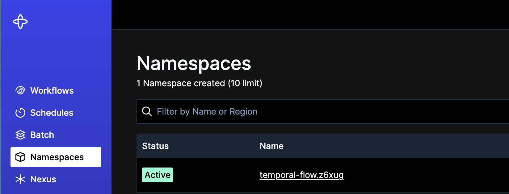

# Temporal Graph UI

**Temporal Graph UI** is a developer tool designed to enhance observability and debugging of workflows within [Temporal](https://temporal.io/). This custom UI presents Temporal workflow executions as an interactive graph, enabling intuitive navigation through nested workflows and a faster, smarter search experience compared to the default Temporal Web UI.

## ✨ Features

- 🔍 **Advanced Search**  
  Quickly locate workflows, activities, and nested executions with an intuitive search bar that supports partial names, workflow types, and more.

- 🧭 **Graph Visualization**  
  Visualize relationships between parent and child workflows as an interactive node graph. This makes it easy to explore deeply nested or complex workflows at a glance.

- 🪄 **Smooth Exploration**  
  Hover and click on graph nodes to inspect workflow details such as execution status, timestamps, and input/output payloads—all without leaving the context of the graph.

- ⚡ **Faster Than the Default UI**  
  Designed with performance and usability in mind to improve speed and developer experience during workflow analysis.

## 📽 Demo

[Watch the demo](./Screen%20Recording%202025-04-11%20at%200.31.33.mov) to see the Temporal Graph UI in action.

## 🚀 Setup

### Generate API key
In Temporal, go to `Namespaces`, choose your namespace:

Scroll down and choose `Generate API Key`, make sure you save you API Key.

## Run local server

See [server README.md](server/README.md).

You can run the server from your IDE or use the Docker Image to run it.

This server is used to fetch the Temporal Events of the workflows so the UI can have all the needed data.
The main reason for this server, is that Temporal doesn't have an API that is accessable from a web application.\
Another reason, is that I don't want to save your Temporal API Key :)

After the server is up and running, go to the [Temporal Flow Page](https://itaisoudry.github.io/temporal-flow-web/) and search search for the workflow you want to view!

## Add your namespace to Temporal Flow
Go to `Search`, click the `Settings` icon.

Now you can add Namespaces and Search Parameters, Add the desired `Namespace` or `Search Parameter` and click the `+` button

Click Save.

Now you can see your `Namespace` at the top, and you should see the default search results:

## Search Syntax
Similar to Temporal search syntax, for example:
* WorkflowId starts with 'batch' - Will search for all the workflows with ids that starts with 'batch'
* Status  = Completed, Status = Running  - Search for workflows by multiple statuses

You can also use Search Parameters, fields with dates like StartTime etc...
 

After completing the search query, press `Search` or hit `Enter` and it will execute the search query.

## Search Results
Using the quick view button, will show you the workflow data.
You can open more than one quick view!

Clicking the `Magnifying Glass` will load the workflow to the graph.

Click on a workflow to expand it and see its child workflows/activities!

## Graph Nodes
There are three types of nodes: Workflow, Activity and Batch.
Clicking the top right button will show you the node data, like in the `Search`.

For batch nodes, click the `Magnifying Glass` to spread the batched nodes in case you are looking for something specific inside.

In the data section of each node you have four tabs: Input/Output, Error, Time and Common which contains all the needed information about a Workflow or Activity.
You can open more than one and drag them around, really helpful if you need to compare between multiple workflows/activities.

# Chrome Extension
You can load workflows from Temporal into Temporal Flow using this chrome extention!

Click the `Magnifying Glass` and it will open a new tab with Temporal Flow and load the chosen Workflow.

For setup, see [chrome-extension README.md](chrome-extension/README.md)).

## 🛠 Issues & Feature Requests

Got feedback, a feature idea, or found a bug?  
Please open an issue right here in the [GitHub Issues](https://github.com/itaisoudry/temporal-flow-web/issues) section of this repository.  
Alternatively, feel free to reach out directly by email.

## 📬 Contact

- **Email**: [temporalflowapp@gmail.com](mailto:temporalflowapp@gmail.com)  
- **LinkedIn**: [www.linkedin.com/in/itai-soudry-257a01123](https://www.linkedin.com/in/itai-soudry-257a01123)

---

Thank you for checking out this project!\
Feedback are always welcome.
